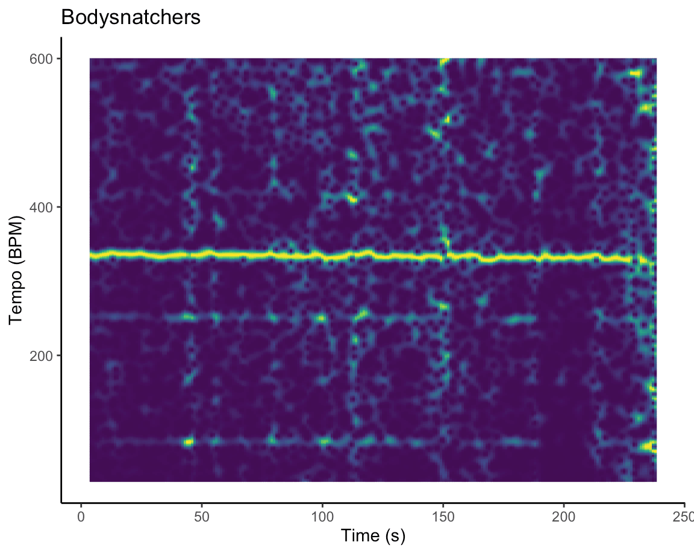

<style>
  body {
  background-image: url("bg.jpeg")}
    font-size: 16px;
  }
  
.section.sidebar {
  top: 61px;
  background-color: rgba(147, 197, 75, 0.1);
}

.value-box {
  color: inherit;
}

.bg-primary {
  background-color: rgba(50, 93, 136, 0.3);
    font-size: 16px;
}

.storyboard-nav .sbframelist ul li.active {
  background-color: rgb(18, 18, 18, 0.6);
  font-size: 16px;
}

.navbar-inverse{
  background-color:#121212;
  border-color:#080808
  font-size: 16px;
}

.storyboard-nav .sbframelist ul li {
    background-color: rgba(255,255,255, 0.85);
    font-size: 16px;
}


.chart-wrapper, .nav-tabs-custom, .sbframe-commentary {
    background-color: rgba(255,255,255, 0.85);
    margin-bottom: 20px;
    margin-right: 10px;
    margin-left: 10px;
    margin-top: 20px;
    padding-top: 20px;
    padding-left: 20px;
    padding-right: 20px;
    font-size: 16px;
}

.chart-wrapper .chart-notes {
    padding: 8px 10px 5px;
    font-size: 16px;
}


}
</style>

```{r setup, include=FALSE}
library(readr)
library(leaflet)
library(DT)
library(lubridate)
library(flexdashboard)
library(tidyverse)
library(spotifyr)
library(ggrepel)
library(grid)
library(plotly)
library(compmus)
library(gridExtra)
library(dplyr)
library(tidymodels)
library(ggdendro)
library(heatmaply)
library(hrbrthemes)
library("RColorBrewer")

get_conf_mat <- function(fit) {
  outcome <- .get_tune_outcome_names(fit)
  fit %>% 
    collect_predictions() %>% 
    conf_mat(truth = outcome, estimate = .pred_class)
}  

get_pr <- function(fit) {
  fit %>% 
    conf_mat_resampled() %>% 
    group_by(Prediction) %>% mutate(precision = Freq / sum(Freq)) %>% 
    group_by(Truth) %>% mutate(recall = Freq / sum(Freq)) %>% 
    ungroup() %>% filter(Prediction == Truth) %>% 
    select(class = Prediction, precision, recall)
}  

```


```{r}
forest_model <-
  rand_forest() %>%
  set_mode("classification") %>% 
  set_engine("ranger", importance = "impurity")
```

```{r}

pablo_honey <- get_playlist_audio_features("", "1S7Bn1zPkqKler2p1MmE2B")
the_bends <- get_playlist_audio_features("", "00aSCr8pdsbOQvmcj41q6z")
ok_computer <- get_playlist_audio_features("", "6yPwcbgFAUXfSsKD9LPnj8")
kid_a <- get_playlist_audio_features("", "0H7oSmnVe8kctcTbr6hYda")
amnesiac <- get_playlist_audio_features("", "7fuj13FdVe98ZPIo9BBWGj")
hail_to_the_thief <- get_playlist_audio_features("", "3GvfHR5ZF5OqeX5YdwCsIQ")
in_rainbows <- get_playlist_audio_features("", "7eV9P6cpSRyYKuLegRNbbe")
the_king_of_limbs <- get_playlist_audio_features("", "2701aFzj6VyyBuSXNo7DfD")
a_moon_shaped_pool <- get_playlist_audio_features("", "0hlGldKBhW9PosAEdFylRJ")

radiohead <-
  bind_rows(
    pablo_honey %>% mutate(playlist = "Pablo Honey"),
    the_bends %>% mutate(playlist = "The Bends"),
    ok_computer %>% mutate(playlist = "OK Computer"),
    kid_a %>% mutate(playlist = "Kid A"),
    amnesiac %>% mutate(playlist = "Amnesiac"),
    hail_to_the_thief %>% mutate(playlist = "Hail To The Thief"),
    in_rainbows %>% mutate(playlist = "In Rainbows"),
    the_king_of_limbs %>% mutate(playlist = "The King Of Limbs"),
    a_moon_shaped_pool %>% mutate(playlist = "A Moon Shaped Pool")
  )

level_order <- c("Pablo Honey", "The Bends", "OK Computer", "Kid A", "Amnesiac", "Hail To The Thief", "In Rainbows", "The King Of Limbs", "A Moon Shaped Pool")
```


### A Moon Shaped Pool of Tears: what makes Radiohead's last album sound so sad? {data-commentary-width=600}

{width=90%} <br><br>
{width=90%}


***
According to the Spotify API, Glass Eyes is Radiohead’s saddest song, with a recorded energy of 0.110 and valence of 0.063, and Bodysnatchers is the band’s most energetic song, with an energy of 0.976 and valence of 0.733. What causes these extreme differences in values? <br><br>
The tempogram of Glass Eyes shows that the song’s tempo is very inconsistent. When listening to the song, it becomes clear why: the song is free of any percussion, and mostly made up of a calm piano melody that was most likely played without following a metronome/tempo (and rather on intuition). This makes the song very hard to tap to, as there appears to be no real tempo even though the Spotify API records a tempo of about 114 BPM. Not being able to detect a tempo in addition to the sad sounding melody makes the song sound even less energetic.<br>

For Bodysnatchers however, the complete opposite holds. The tempo is very clear and steady, and also quite high. Whereas the Spotify API records a tempo of about 167 BPM, the tempogram displays a very clear line at two times this tempo (334 BPM). In fact, the tempogram does not show anything at the actual tempo of 167 BPM. In any case, the clear, steady and high tempo of the song make it very energetic.<br>