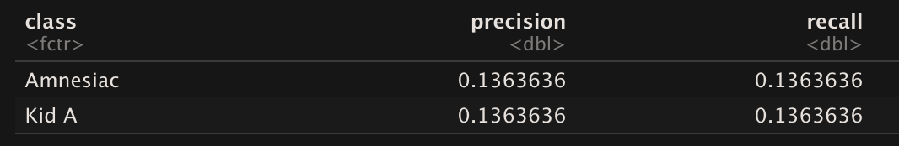

<style>
  body {
  background-image: url("bg.jpeg")}
  }
  
.section.sidebar {
  top: 61px;
  background-color: rgba(147, 197, 75, 0.1);
}

.value-box {
  color: inherit;
}

.bg-primary {
  background-color: rgba(50, 93, 136, 0.3);
}

.storyboard-nav .sbframelist ul li.active {
  background-color: rgb(18, 18, 18, 0.6);
  font-size: 14px;
}

.navbar-inverse{
  background-color:#121212;
  border-color:#080808
}

.storyboard-nav .sbframelist ul li {
    background-color: rgba(255,255,255, 0.85);
    font-size: 14px;
}


.chart-wrapper, .nav-tabs-custom, .sbframe-commentary {
    background-color: rgba(255,255,255, 0.85);
    margin-bottom: 20px;
    margin-right: 10px;
    margin-left: 10px;
    margin-top: 20px;
    padding-top: 20px;
    padding-left: 20px;
    padding-right: 20px;
}

.chart-wrapper .chart-notes {
    padding: 8px 10px 5px;
    font-size: 16px;
}


}
</style>

```{r setup, include=FALSE}
library(readr)
library(leaflet)
library(DT)
library(lubridate)
library(flexdashboard)
library(tidyverse)
library(spotifyr)
library(ggrepel)
library(grid)
library(plotly)
library(compmus)
library(gridExtra)
library(dplyr)
library(tidymodels)
library(ggdendro)
library(heatmaply)
library(hrbrthemes)
library("RColorBrewer")

get_conf_mat <- function(fit) {
  outcome <- .get_tune_outcome_names(fit)
  fit %>% 
    collect_predictions() %>% 
    conf_mat(truth = outcome, estimate = .pred_class)
}  

get_pr <- function(fit) {
  fit %>% 
    conf_mat_resampled() %>% 
    group_by(Prediction) %>% mutate(precision = Freq / sum(Freq)) %>% 
    group_by(Truth) %>% mutate(recall = Freq / sum(Freq)) %>% 
    ungroup() %>% filter(Prediction == Truth) %>% 
    select(class = Prediction, precision, recall)
}  

```


```{r}
forest_model <-
  rand_forest() %>%
  set_mode("classification") %>% 
  set_engine("ranger", importance = "impurity")
```

```{r}

pablo_honey <- get_playlist_audio_features("", "1S7Bn1zPkqKler2p1MmE2B")
the_bends <- get_playlist_audio_features("", "00aSCr8pdsbOQvmcj41q6z")
ok_computer <- get_playlist_audio_features("", "6yPwcbgFAUXfSsKD9LPnj8")
kid_a <- get_playlist_audio_features("", "0H7oSmnVe8kctcTbr6hYda")
amnesiac <- get_playlist_audio_features("", "7fuj13FdVe98ZPIo9BBWGj")
hail_to_the_thief <- get_playlist_audio_features("", "3GvfHR5ZF5OqeX5YdwCsIQ")
in_rainbows <- get_playlist_audio_features("", "7eV9P6cpSRyYKuLegRNbbe")
the_king_of_limbs <- get_playlist_audio_features("", "2701aFzj6VyyBuSXNo7DfD")
a_moon_shaped_pool <- get_playlist_audio_features("", "0hlGldKBhW9PosAEdFylRJ")

radiohead <-
  bind_rows(
    pablo_honey %>% mutate(playlist = "Pablo Honey"),
    the_bends %>% mutate(playlist = "The Bends"),
    ok_computer %>% mutate(playlist = "OK Computer"),
    kid_a %>% mutate(playlist = "Kid A"),
    amnesiac %>% mutate(playlist = "Amnesiac"),
    hail_to_the_thief %>% mutate(playlist = "Hail To The Thief"),
    in_rainbows %>% mutate(playlist = "In Rainbows"),
    the_king_of_limbs %>% mutate(playlist = "The King Of Limbs"),
    a_moon_shaped_pool %>% mutate(playlist = "A Moon Shaped Pool")
  )

level_order <- c("Pablo Honey", "The Bends", "OK Computer", "Kid A", "Amnesiac", "Hail To The Thief", "In Rainbows", "The King Of Limbs", "A Moon Shaped Pool")
```


```{r}
test <- radiohead %>%
    group_by(playlist) %>%
    summarize(meanEnergy = mean(energy), 
              meanValence = mean(valence), 
              meanLoudness = mean((loudness-min(loudness))/(max(loudness)-min(loudness))), 
              meanTempo = mean((tempo-min(tempo))/(max(tempo)-min(tempo))), 
              meanAcousticness = mean(acousticness))

```

### **The Evolution of Radiohead** {data-commentary-width=500}


***
The corpus I chose for my analysis contains all 101 songs from Radiohead's 9 studio albums, that is "Pablo Honey", "The bends", "OK Computer", "Kid A", "Amnesiac", "Hail to the Thief", "In Rainbows", "The King of Limbs" and "A Moon Shaped Pool". Radiohead is one of my all-time favorite bands. Over the course of their nine albums, they have changed their musical style drastically a couple of times. To me, each of their albums carries a distinct sound and feeling associated with it, and I am keen to find out the musical details behind their style evolution.<br>

The questions this portfolio will answer are:<br>

* How did Radiohead's style change over time?
* How does a classifier perform on Radiohead's different albums?


Though each album is centered around a main theme, the songs within an album often range in sound. For example, *The Bends*' Fake Plastic Trees" is a soft and calm song, but "My Iron Lung" is hard-rock to say the least. On the other hand,  the album "Amnesiac" in general has very similar sounds to "Kid A" as they were recorded during the same sessions. These differences and similarities can make it difficult to track meaningful changes.<br>

A short history regarding Radiohead's discography:<br>

***Pablo Honey***, **1993** <br>
The band’s grunge sounding debut album, *Pablo Honey*, sets itself apart from the rest of the band’s album and was made before Radiohead found their own sound.  The grunge sounding album caused Radiohead to be compared to bands like Nirvana. The album did not get much critical acclaim, except from the hit-single *Creep*, which has grown out to be Radiohead’s most famous song.<br>
***The Bends***, **1995** <br>
*The Bends* is more polished and complex compared to the band’s first album, and contains a greater use of keyboards, as well as the band’s first introduction to the use of effects. The album received stronger reviews for its songwriting and performances, and songs made their way to the charts, with *Street Spirit (Fade Out)* placing them in the top 5. The album was said to be influenced by bands like Pink Floyd.<br>
***OK Computer***, **1997** <br>
Instead building on the succes *The Bends* by releasing an album in a similar style, Radiohead instead took their musical style in the opposite direction with *OK Computer*, incorporating an ambient, avant-garde and electronic influences, expressing feelings of emptiness that the band felt were present in Western society. *OK Computer* quickly grew out to be the band’s most famous album and still is to this day. The massive succes and critical acclaim of the album introduced the band to commercial succes around the world and sold out shows in big arenas. <br>
***Kid A***, **2000**<br>
The fame the band gained from *OK Computer* brought a lot of pressure and stress upon the band, and caused lead singer Tom Yorke to become depressed and suffer from writers block. The new album *Kid A* came from the only inspiration the band had left: “Melody is dead, rhythm is king”. Out went the use of analogue instruments and the influence of pop and rock. Instead, the band started using synthesizers and electronic drums, making the album electronic sounding and less complex than previous records and marking the beginning of their own characteristic sound. Whereas opening track *Everything In Its Right Place* is a good illustration of the electronic feel of the album, *How to Disappear Completely* is an exception, being the only song with an acoustic guitar and orchestral composition. With its unsteady melody and fluctuating key, the uncomfortable sounding song is a portrayal of Tom’s depression after the release of *OK Computer*.<br>
***Amnesiac***, **2001**<br>
*Amnesiac* contains songs from the same studio recording sessions as *Kid A*, and is therefore often labeled as the B-side of *Kid A*. However, the band claims to have carefully divided the songs over the two albums, creating two different feels. They describe *Kid A* as “*watching a forest fire happen*”, and *Amnesiac* as “*being in the middle of that forest fire*”, most likely meaning that *Kid A* is more of a description of Tom’s mental struggle and *Amnesiac* directly portrays it. One of its most popular and typical songs is *Knives Out*/*Pyramid Song*.<br>
***Hail To The Thief***, **2003**<br>
With *Hail To The Thief*, the band combined their new electronic style with the their old rock style, with songs like *There, There* incorporating both. Lyrics were influenced by "the general sense of ignorance and intolerance and panic and stupidity" following the 2000 election of US President George W. Bush. The album also marked the end of their contract with label EMI, and from now on the band’s albums would be self-released.<br>
***In Rainbows***, **2007** <br>
The band’s first self-released album continues on their new sound mixture of electronic and rock, as illustrated by most popular song *Weird Fishes/Arpeggi*. The album received acclaim for its more accessible sound and personal lyrics.<br>
***King of Limbs***, **2011**<br>
*King of Limbs* is very experimental, containing the use of sampling and loops, making songs like *Lotus Flower* more rythmically complex.<br>
***A Moon Shaped Pool***, **2016** <br>
The recording sessions of Radiohead’s most recent album were marred by the death of Godrich's father and Yorke's separation from his wife who died from cancer in 2016. The songs are orchestral, haunting and slow. The album also contains some songs that the band worked on throughout their whole discography, making the album a bit eclectic of Radiohead’s different styles.<br>

### **A general overview of changes throughout Radiohead's nine studio albums**  {data-commentary-width=500}
```{r}
line_plot <- ggplot(test, aes(x=factor(playlist, level=level_order), group = 1)) + 
  geom_line(aes(y = meanValence, colour = "Valence", group=1, alpha=0.5, text=paste("Album:", playlist, "\nValence:", meanValence)), show.legend = FALSE) + 
  geom_text(aes(x=0.6, y=meanValence[[7]], label='Valence'), col='deepskyblue3', size =2.5) +
  geom_line(aes(y = meanEnergy, colour="Energy", group=2, alpha=0.5, text=paste("Album:", playlist, "\nEnergy:", meanEnergy))) +
  geom_text(aes(x=0.6, y=meanEnergy[[7]], label='Energy'), col='green3', size =2.5) +
  geom_line(aes(y= meanLoudness, colour="Loudness", group=3, alpha=0.5, text=paste("Album:", playlist, "\nLoudness:", meanLoudness))) +
  geom_text(aes(x=0.5, y=meanLoudness[[7]], label='Loudness'), col='red', size =2.5) +
  geom_line(aes(y= meanTempo, colour="Tempo", group=4, alpha=0.5, text=paste("Album:", playlist, "\nTempo:", meanTempo))) +
  geom_text(aes(x=0.6, y=meanTempo[[7]], label='Tempo'), col='purple', size =2.5) +
  geom_line(aes(y = meanAcousticness, colour = "Acousticness", group=5, alpha=0.5, text=paste("Album:", playlist, "\nAcousticness:", meanAcousticness))) + 
  geom_text(aes(x=0.45, y=meanAcousticness[[7]], label='Acousticness'), col='black', size =2.5) +
  scale_colour_manual("", 
                      breaks = c("Valence", "Energy", "Loudness", "Tempo", "Acousticness"),
                      values = c("deepskyblue3", "green3", "red", "purple", "black"))+
  scale_y_continuous(         # Fine-tune the y axis in the same way.
    limits = c(0, 1)) +
  scale_x_discrete(guide = guide_axis(n.dodge=2)) +
  theme(axis.text.x = element_text(size = 7)) +
    labs(
    x = "",
    y = "Value"
  ) +
  theme(
        axis.text.x = element_text(angle=30, hjust="1")
  )+
  scale_x_discrete(expand = c(0.14, 0)) +
   theme(legend.position = "none")

ggplotly(line_plot, tooltip = c("text"))
```


***
For this visualisation, the loudness and tempo of the songs were normalized to be between 0 and 1. <br><br>
**Energy** starts off quite high, as is to be expected from the grunge style Radiohead debuted with. For the most part, **energy** and **valence** seem to follow the same trend throughout the albums, both dropping from ***The Bends*** until ***Amnesiac***. As the combination low valence and low energy portrays sadness, the decreasing valence and energy until ***Amnesiac*** could well be a reflection of the worsening mental health of lead singer Tom Yorke. After ***Amnesiac***, energy and valence largely increase on ***Hail to The Thief*** and roughly stay the same until ***The King Of Limbs***, reflecting the happier and relaxed state of mind of the band well. Both drop drastically on ***A Moon Shaped Pool***, representing the sad circumstances the band found themselves during the recording of the album.<br>

What is remarkable is that **energy**, **valence** and **loudness** all decrease from ***Kid A*** to ***Amnesiac***, possibly confirming that ***Amnesiac*** is indeed more of a direct representation of Tom’s depressed mental state than ***Kid A***. Furthermore, these three variables are lowest on ***A Moon Shaped Pool***, contributing confirming that it is the saddest record Radiohead has made. ***Hail To The Thief*** and ***In Rainbows*** are almost exactly the same concerning valence and energy, with loudness only differing a tiny bit. In Rainbows being the album that followed up Hail To The Thief could be the explanation for this, however the albums are more than 4 years apart. <br>

For **tempo**, the most remarkable finding is that it indeed increases on **Kid A** and **Amnesiac**, representing the motto “*rhythm is king*”.<br>

Weirdly enough, **acousticness** is low from ***Pablo Honey*** to ***OK Computer***, high on ***Kid A*** and ***Amnesiac*** and slightly decreases for the two albums after that. The opposite was to be expected, as it is on ***Kid A*** and ***Amnesiac*** that the band used mostly electronic sounds and barely analog instruments.


### **Is there a "Radiohead Formula"? (1/2)**{data-commentary-width=400}
```{r}
all_songs <- ggplot(radiohead, aes(x = valence, y = energy, size = loudness, color = factor(playlist_name, level = level_order), label = track.name, text=paste("Song:", track.name, "\nAlbum:", track.album.name, "\nEnergy:", energy, "\nValence:", valence, "\nLoudness:", loudness))) +  
  geom_point(show.legend = T, alpha=0.8) +
    scale_size_continuous(      # Fine-tune the sizes of each point.
    trans = "exp",            # Use an exp transformation to emphasise loud.
  ) +
  labs(
    title = "Valence, Energy and Loudness for each song",
    x = "Valence",
    y = "Energy"
  ) +
  theme_light()+
  theme(plot.title = element_text(hjust = 0.5)) +
geom_smooth(aes(group = 1), method = "lm", formula= (y ~ log(x)), se = TRUE) +
  theme(legend.title = element_blank())
  
ggplotly(all_songs, tooltip = c("text"))
```

***
To further look into the features within the albums, we can look at each the individual songs from each album. Loudness is displayed as the size of the point corresponding to a song. The plot is interactive, meaning you can also hide certain albums by clicking on them in the legend. <br><br>
From this plot, we can infer that ***Bodysnatchers*** is Radiohead's happiest song, being high in valence, energy and loudness. The saddes song seems to be ***Glass Eyes***, being low in valence, energy and loudness. <br><br>
When looking at the energy and valence of each song, there seems to be a logarithmic relationship, where **Energy = log(Valence)**, which is shown as a line containing the standard deviation around it. This seems to be a pretty good fit, and makes it seem like there is a "Radiohead formula".In music, it generally holds that low energy/low valence songs are considered “sad”, low valence/high energy ones are “angry”, those with high valence and low energy are “calm” and those with both high values are “happy”. Considering the graph, it seems Radiohead's songs are mostly sad, followed by angry and then happy. 
The point that deviates from the pattern the most is ***Fitter Happier*** from ***OK Computer***.


### **Is there a "Radiohead Formula"? (2/2)**{data-commentary-width=400}

```{r}
all_songs2 <- ggplot(radiohead, aes(x = valence, y = energy, size = loudness, color = factor(playlist_name, level = level_order), label = track.name, text=paste("Song:", track.name, "\nEnergy:", energy, "\nValence:", valence, "\nLoudness:", loudness))) +  
  geom_point(show.legend = T, alpha=0.8) +
    scale_size_continuous(      # Fine-tune the sizes of each point.
    trans = "exp",            # Use an exp transformation to emphasise loud.
  ) +
  labs(
    title = "Valence, Energy and Loudness per Album",
    x = "Valence",
    y = "Energy"
  ) +
  facet_wrap(~factor(playlist_name, level=level_order)) +
geom_smooth(aes(group = 1), method = "lm", se = FALSE, size=0.7) +
    scale_x_continuous(         # Fine-tune the x axis.
    limits = c(0, 0.85),
    breaks = c(0, 0.50, 1)   # Use grid-lines for quadrants only.
  ) +
  scale_y_continuous(         # Fine-tune the y axis in the same way.
    limits = c(0, 1.1),
    breaks = c(0, 0.50, 1)
  ) +
    theme_light()+
     theme(legend.position = "none")
  
ggplotly(all_songs2, tooltip = c("text"))
```

***
We now look at the valence, energy and loudness of individual songs within each album. Again, loudness is displayed as the size of the point corresponding to a song. <br><br>
Energy and valence fit nice linear lines for each album, with energy increasing linearally when valence increases, making it seem that valence and energy follow a different formula within each album.<br><br>
Furthermore, some albums' features are more clustered than others. ***Pablo Honey***, ***OK Computer***, ***A Moon Shaped Pool*** and ***Amnesiac*** seem to be clustered around 1 point (with some outliers), ***Kid A*** and ***In Rainbows*** around 2 points and ***The Bends*** around 3. ***Hail To The Thief*** and ***The King Of Limbs*** don't obey to a certain cluster, with valence and energy differing most throughout the individual songs.


### **A closer look: keys, modes, tempos and popularities within each album**  {data-commentary-width=500}

```{r}
albums_tempos <- radiohead %>%
  ggplot(aes(x = factor(playlist_name, level=level_order), y = tempo, fill = playlist_name)) +
    labs(
    x = "",
    y = "Tempo",
    title = "Tempos"
  ) +
  geom_boxplot(aes(alpha=0.5))+
  theme_light() +
    theme(
        axis.text.x = element_text(angle=30, hjust="1"), legend.position = "none",  axis.text=element_text(size=7))
```

```{r}
albums_modes <- radiohead %>%
  ggplot(aes(x = factor(mode), fill = playlist_name)) +
   geom_bar(show.legend = FALSE)  +
    labs(
    x = "",
    y = "Count",
    title = "Modes"
  ) +
  facet_wrap(~factor(playlist_name, level=level_order))+
  scale_x_discrete(labels = c('Minor', 'Major'))+
  theme_light()+
  theme(strip.text = element_text(size=7))
```

```{r}
key <- as.factor(radiohead$key)
key <- recode(key, 
               "0" = "C",
               "1" = "Db",
               "2" = "D",
               "3" = "Eb",
               "4" = "E",
               "5" = "F",
               "6" = "Gb",
               "7" = "G",
               "8" = "Ab",
               "9" = "A",
               "10" = "Bb",
               "11" = "B")


albums_keys <- radiohead %>%
  ggplot(aes(x = factor(key), fill = playlist_name)) +
   geom_bar(show.legend = FALSE)  +
    labs(
    x = "",
    y = "Count",
    title = "Keys"
  ) +
  facet_wrap(~factor(playlist_name, level=level_order))+
    scale_x_discrete(labels = c('C', 'Db', 'D', 'Eb', 'E', 'F', 'Gb', 'G', 'Ab', 'A', 'Bb', 'B')) +
  theme_light()+
  theme(strip.text = element_text(size=7), axis.text=element_text(size=5))
```

```{r}
albums_pop <- radiohead %>%
  ggplot(aes(x = factor(playlist_name, level=level_order), y = track.popularity, fill = playlist_name)) +
    labs(
    x = "",
    y = "Popularity",
    title = "Popularity"
  ) +
  geom_boxplot(aes(alpha=0.5))+
  theme_light() +
    theme(
        axis.text.x = element_text(angle=30, hjust="1"), legend.position = "none", axis.text=element_text(size=7))
```


```{r}
stats <- grid.arrange(albums_keys, albums_modes, albums_tempos,albums_pop, ncol=2)
```

***
**Keys**: for the most part, at least from ***Pablo Honey*** until ***Hail To The Thief**, G seems to be the band's most preferred key, followed by C and D. The least preferred keys seem to be Ab and Gb, which makes sense as they are close to G. Furthermore, Eb is not often used.<br><br>
**Modes**: from ***Pablo Honey*** to ***Kid A***, clearly most songs are in major, and from ***Amnesiac*** until ***In Rainbows*** most songs are in minor. This is striking, as minor keys are often perceived as sad, while for example ***In Rainbows*** is perceived as Radiohead's happiest album. On the other hand, major modes are often perceived as happy, while Radiohead's saddest album, ***A Moon Shaped Pool***, is contained mostly of major modes. <br><br>
**Tempos**: what immediately stands out in terms of tempo is that ***A Moon Shaped Pool*** has the highest mean tempo, which seems atypical for a sad album. On the other hand, ***In Rainbows*** has the lowest mean tempo, which is again atypical for an album often regarded as one of the happier ones.<br><br>
**Popularity**: Radiohead's rising popularity up until ***OK Computer*** is clearly visible, as well as the fact that ***Creep*** was the only song from ***Pablo Honey*** that got popular (as pictured by the grey dot). It's interesting to see that the band found their distinct style that people praise them for *after* **OK Computer**, but their popularity staggered up until ***In Rainbows***. What I also did not know is that ***In Rainbows*** is actually on more popular than ***OK Computer*** when regarding all songs from the album. From the graph it can however be seen that ***OK Computer*** does contains Radiohead's most famous song, namely *Karma Police*.


### **Melody is dead: the becoming of Radiohead's typical style through chroma analysis**{data-commentary-width=400}

{width=90%}<br><br>

***
On the left, we can see nine self-similarity matrixes of the chromagrams from songs from nine different Radiohead songs, each from a different album. Chroma tells us something about the pitch in the song. Blocks show homogenuity in chroma, vertical parallel lines show repitition in chroma and vertical yellow lines show changes in chroma.<br>
For the comparisons of individual songs from the albums, I chose the song that is most popular according to Spotify. This seemed to me like a good representation of the general feel of the album to listeners, as an album’s most popular song is often the song that people hear most and therefore the the song people associate the album with. To me at least, each song represents my general perception of the album’s style well.<br><br>
In the chromagrams, parallel diagonal lines show that the songs from first three albums all contain repetitions of some sort of melody or riff. As humans often like repetition within a song, the songs’ characteristic melodies most likely contributed to their popularity. For ***Creep*** and ***Street Spirit***, the repetition of melodies and song structures are most evident, with both songs containing a repeated riff throughout the entire song and  clear vertical yellow lines for where a section such as a chorus or verse starts. ***Karma Police*** consists of two different parts and with that two different melodies, the transition being around 2:32. When looking at these two parts separately, the repeating melodies become clear.<br><br>
A clear change happens when we move onto ***Kid A***: sure enough, *melody is dead*. The song’s structure is clear and a distinction between the verses, chorusses, and bridge remains, yet there is no distinct repeating melody. For ***Amnesiac***, there is some repitition, but the song’s structure is nowhere to be found. The start of the song even appears to have no cohesian at all, most likely due to the fact that this part only contains a piano being played according to an irregular tempo. It is only after 2 minutes, when percussion sets in, that some homogeneity occurs. The irregular melodies and lack of structure within both of these songs make them sound uncomfortable and eerie, clearly displaying the band’s state of mind at the time.<br><br>
With ***Hail To The Thief***’s ***There, There***, we regain structure and repitition, with the reintroduction to yellow lines dividing verses and chorusses and, after the second chorus, parallel diagonal lines indicating the repeating melody of the song. Moving onto ***In Rainbows*** With ***Weird Fishes/Arpeggi***, the return of the use of melody is even more apparent, with the song consisting of 3 parts in which the same riff is repeated.
***Lotus Flower*** from the experimental album ***The King Of Limbs*** stands out again, as it contains no visible repititions, even though the song is made up of loops and repeated samples. This is most likely due to the fact that there is no pattern in how the different loops are overlayed. The borders between chorusses and verses are however very distinct.<br><br>
Lastly, ***Daydreaming*** from ***A Moon Shaped Pool*** contains a very chaotic structure. Though there are some repititions and homogenuities to be found when looking closely, the song seems to be very inconsistent. This is due to the fact that the song is a mixture of several piano melodies layered with several electronic and orchestral sounds of short duration, setting in randomly and thus making the sound quite unstructured.

### **Does a classifier model agree that each Radiohead album has a distinct style?** {data-commentary-width=500}
{width=90%}<br><br>
{width=90%}

***
Most people will agree that each Radiohead album is different, *Kid A* and *Amnesiac* being exceptions. Does a classifier model agree with this statement?<br><br>
The confusion matrix on the left show the classificaiton results of a random forest classification model, trained on the Spotify features from Radiohead's studio albums. All features were used, as removing features did not improve results, possibly indicating that all features play some significant part in the classification of the albums. The importance of features was as follows:<br><br>
{width=70%}<br><br>
It can be seen that the classifier managed to distinguish  ***Pablo Honey*** and ***Hail To The Thief*** particularly well. For the other albums, it performed significantly less good, especially ***Amnesiac*** and ***The King Of Limbs*** with 0 correct classifications.<br><br>
What is striking though, is that there seem to be groups within the misclassifications:

* Group 1: ***Pablo Honey***, ***The Bends*** and ***OK Computer***
* Group 2: ***Kid A***, ***Amnesiac***, ***Hail To The Thief***, ***In Rainbows*** and ***A Moon Shaped Pool***

***The King Of Limbs*** does not fall into any of these two groups, which can be explained by the fact that it is a very experimental album and contains very few songs.<br><br>
The groups are often seen as the two main style periods of Radiohead, as they started incorporating their electronic sound with *Kid A*. The fact that acousticness and the second timbre component, often associated with low frequencies/darkness, were most important during classifying support this. When looking at the graph showing these features, we can see that the songs of group 1 are mostly concentrated in the upper left corner, while the songs of the second group are more towards the right and bottom. <br><br>
It appears that the classifier has a hard time accurately distinguishing each album, but can distinguish the two main different style periods radiohead has had.

### **To B-side or not to B-side: Kid A versus Amnesiac** {data-commentary-width=550}

{width=90%} <br><br>
{width=90%}

***
As said before, ***Amnesiac*** is often said to be ***Kid A***'s "B-side" as both albums were recorded during the same sessions, but the band claims the albums each portray something different: ***Kid A*** portraying watching depression from a distance, and ***Amnesiac*** portraying experiencing it first hand. Within our previous classifier, the albums, along with most albums within that style period, were hard to distinguish. When training a random forest classifier on only *Kid A* and *Amnesiac* using all features, we obtain the following importance for each feature<br><br>
{width=70%}<br><br>
and the following (bad) precision and recall when classiying the albums <br><br>
{width=70%}<br>
<br> meaning the classifier mixed the albums up most of the time. However, when taking the importance of features into account, removing unimportant features greatly improves classification. When taking the first four features, so **loudness** and **the twelth, ninth and sixth timbre component**, we get the results as displayed in the confusion matrix on the left. Further looking into a comparison of the timbre components of both the albums confirms that the albums differ in said components most. <br><br>
There thus indeed seems to be a difference between *Kid A* and *Amnesiac*. However, the model needed to look specifically at timbre components to distinguish them, and what those timbre components exactly are in terms of sound are hard to determine. With that, timbre componentsare hard for humans to hear, so which leaves only loudness as a metric for humans to distinguish the albums by ear, possibly contributing to the reason that humans *can't* and a computer *can* see the difference between the albums.


### **A Moon Shaped Pool of tears: what makes Radiohead's last album sound so sad?** {data-commentary-width=550}

{width=90%} <br><br>
{width=90%}


***
We have seen that *A Moon Shaped Pool* is clearly Radiohead's saddest album. According to the Spotify API, ***Glass Eyes*** from ***A Moon Shaped Pool*** is Radiohead’s saddest song, with a recorded energy of 0.110 and valence of 0.063, and ***Bodysnatchers*** from ***In Rainbows*** is the band’s happiest song, with an energy of 0.976 and valence of 0.733. What causes these extreme differences in values? <br><br>
The tempogram of ***Glass Eyes*** shows that the song’s tempo is very inconsistent. When listening to the song, it becomes clear why: the song is free of any percussion, and mostly made up of a calm piano melody that was most likely played without following a metronome/tempo (and rather on intuition). This makes the song very hard to tap to, as there appears to be no real tempo even though the Spotify API records a tempo of about 114 BPM. Not being able to detect a tempo in addition to the sad sounding melody makes the song sound even less energetic.<br>

For ***Bodysnatchers*** however, the complete opposite holds. The tempo is very clear and steady, and also quite high. Whereas the Spotify API records a tempo of about 167 BPM, the tempogram displays a very clear line at two times this tempo (334 BPM). In fact, the tempogram does not show anything at the actual tempo of 167 BPM. In any case, the clear, steady and high tempo of the song make it very energetic and happy sounding.<br>


### **Final thougths**{data-commentary-width=550}

{width=90%}

***
From the analysis of Radiohead's style evolutions using Spotify features, we have made some interesting remarks. 
* The history behind Radiohead's nine albums was clearly reflected in changes in loudness, energy and valence, all dropping when personal circumstances were bad and rising when they were good. 
* Radiohead's music is never "angry" in terms of valence and energy.
* Radiohead's saddest albums suprisingly mostly use major modes.
* In their first three albums, Radiohead used a clear repitition of a melody in their songs, which we can clearly see being absent in ***Kid A*** and ***Amnesiac***, reflecting the result of the band's writers block and new mindset. With ***Hail To The Thief***, melody returns.
* Radiohead's happier songs use a steady tempo making them energetic and easy to follow the rhythm by tapping along, while with sad songs the tempo is all over the place making it impossible to tap along to and not energetic at all. <br>

From the classification it became clear that Radiohead's music can be devided into two periods, namely
* Period 1: ***Pablo Honey***, ***The Bends*** and ***OK Computer***
* Period 2: ***Kid A***, ***Amnesiac***, ***Hail To The Thief***, ***In Rainbows*** and ***A Moon Shaped Pool***
with ***The King Of Limbs*** being its own period as the album is so experimental.<br><br>
Furthermore, it became clear that timbre coefficients, while mostly unhearable to the human ear, play an important role in the computational analysis of music. Using these coefficients, one can also distinguish ***Kid A***  from ***Amnesiac***.<br>

This analysis is specific to one band, but the same computations can be applied to analyze other collections of music. The current results could be used when trying to replicate components of Radiohead's style, or just to get more insight in what certain features cause in terms of sound and style. Or it can even simply be used by listeners of Radiohead, that want to listen to songs or albums with particular features, such as only happy or only sad songs.<br>

The insight that timbre is so important within a certain musical style calls for further research, as right now we have established which components contribute to different styles but not exactly what they *are*.
